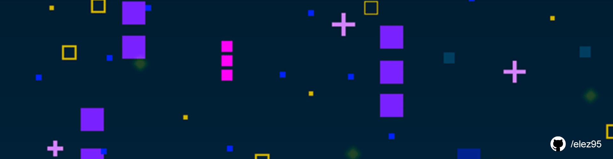
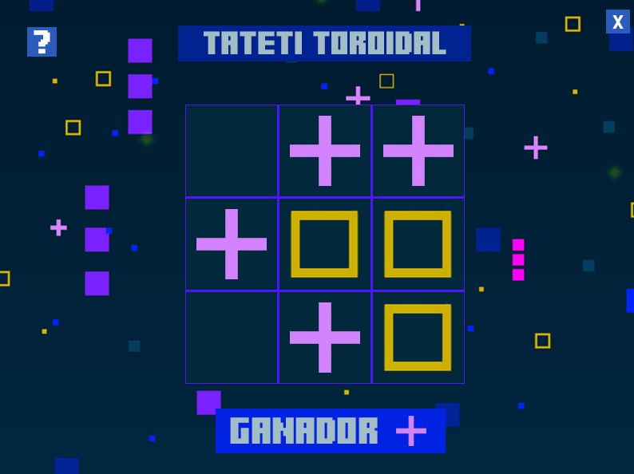
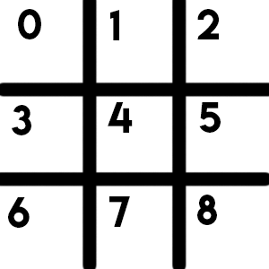
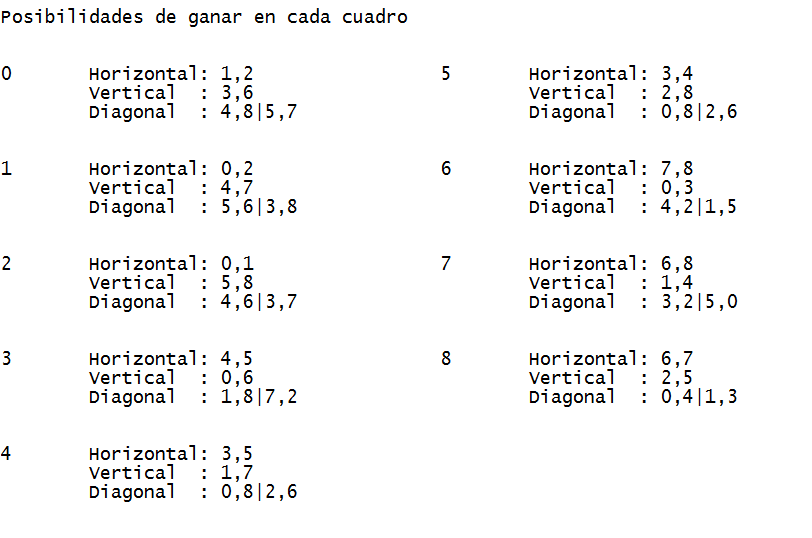

# TATETI TOROIDAL

Código del juego TA-TE-Toro, inspirado en el clásico juego Tateti (tic tac toe). Juego para dos jugadores. Hecho en Java.



## Tabla de Contenidos

- [Introducción](#introducción)
- [Características](#características)
- [Instalación](#instalación)
- [Contribución](#contribución)
- [Licencia](#licencia)

## Introducción

El juego se basa en el clásico ta-te-ti sobre un tablero 3x3, pero se considera que las celdas están conectadas de manera toroidal. Es decir, un jugador gana si ubica tres piezas propias en tres celdas seguidas, y se considera que una diagonal continúa del otro lado del tablero.

## Características

- Lógica de victoria: Cada una de las 9 celdas tienen un grupo de combinaciones posibles para lograr la victoria, se tiene en cuenta las diferentes orientaciones que el jugador elija (horizontal, vertical, diagonal).
  

<table style="width:100%">
<tr>
<td>
<a>

</a>
</td>
<td>
<a >

</a>
</td>

</tr>
</table>

## Clases

### Interfaz

Se encarga de mostrar en pantalla el desarrollo del juego. Fue diseñado con WindowBuilder. Tiene un JPanel con nueve botons que emulan las celdas del tablero y todo esto está sobre un JFrame.

### Juego

Es la clase intermediaria entre la parte visual y la parte inteligente de la aplicación. Su función es brindar recursos a la interfaz implementeada conectando con el código de negocio de las demás clases. Sus métodos son:

- cargarPosiciónEnTablero(int posicion): Guarda en el tablero el símbolo (cruz o círculo) según la ubicación pasada como parámetro.
- seRepite(int posición): Verifica que esa posición del tablero no esté vacío.

### Tablero

  En esta clase se controla el estado de la celdas del tablero.

  - cambiarEstado(int indice, String turno): Cambia el valor de la posición en el tablero.
 
### Control

  El objetivo de esta clase es hacer consultas para verificar durante el juego si hubo un ganador.

  - hayGanador(int posicion, Combinaciones combinacion, Tablero t): Revisa que en la ubicación recientemente cargada no haya una combinación ganadora entre las diferentes orientaciones.
  - esTatetiHorizontal(int posicion, Combinaciones combinacion, Tablero tableroActual): Se carga en una colección de datos las tres posiciones que le corresponden para ganar en la posición ingresada por parámetro. Ídem para esTatetiVertical, esTatetiDiagonalA, esTatetiDiagonalB.
  - verCoincidencia(Tablero tableroActual, int[] ubicaciones ganadoras): Revisa que en el actual tablero haya una igualdad en las posiciones ganadoras pasadas por parámetro.
 
### Combinaciones

  Su única función es ser un repositorio con todas las posibles combinaciones ganadoras para cada posición del tablero en todas sus orientaciones.

## Instalación

```shell
$ git clone https://github.com/elez95/Tateti-Toroidal.git
```

## Contribución

Puedes colaborar haciendo un fork del proyecto y creando nuevas características al juego como:
- Reiniciar el juego una vez lograda una partida.
- Agregar tablero con el puntaje de cada jugador.
